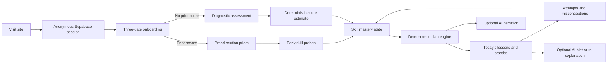

# AI ACT Tutor — Technical Architecture

## 1. Architecture decision

Build one full-stack TypeScript application for the hackathon. Separate the learning engine into pure modules, but do not create separate web and API services until scale requires it.



The dependency arrow points from AI to trusted data, never from trusted scoring to AI output.

## 2. Stack

This table describes the target MVP architecture. The first local slice currently implements the Next.js/pnpm/UI/core/Vitest portions; rows that mention Supabase, Playwright, AI, deployment, and monitoring are planned rather than present.

| Layer | Current/target choice | Reason |
|---|---|---|
| Application | Next.js App Router + TypeScript | One deployable frontend/BFF, fast collaboration, good preview workflow |
| Package manager | pnpm workspace | Shared pure packages without unnecessary monorepo tooling |
| UI | Tailwind CSS + shadcn components built on Base UI | Fast, accessible primitives and consistent states |
| Forms | React state in the current slice; React Hook Form + Zod planned where form complexity requires it | Shared client/server validation for scores, dates, and answers without forcing a second form abstraction prematurely |
| Database | Supabase Postgres | Hosted relational data, auth, migrations, RPC, and RLS |
| Authentication | Supabase anonymous auth; link email later | No login wall, but durable server-owned records |
| DB access | `@supabase/ssr`, `supabase-js`, generated types | Direct JWT/RLS model with minimal ORM overhead |
| AI | Internal interface + provider adapters | Switch providers without touching learning logic |
| First AI adapter | Cloudflare Workers AI Qwen | Chinese/open-weight model option with a free allocation and simple hosted inference |
| Deployment | Vercel + Supabase | Low-friction previews and production deployment |
| Tests | Vitest + Playwright + Supabase pgTAP | Pure logic, end-to-end journeys, and RLS coverage |
| Monitoring | Sentry + structured privacy-safe events | Enough visibility for demo and MVP |

Cloudflare Workers AI currently lists Qwen text-generation models and provides a daily free allocation; treat the quota as a replaceable demo dependency, not a permanent business model. See the [model catalog](https://developers.cloudflare.com/workers-ai/models/) and [pricing](https://developers.cloudflare.com/workers-ai/platform/pricing/). Alibaba Model Studio is a second Qwen option, but its new-user quota is time-limited and region-specific, so enable its “Free Quota Only” control before using it. See [Alibaba's quota rules](https://www.alibabacloud.com/help/en/model-studio/new-free-quota).

## 3. Target repository layout

The current repository has a smaller vertical-slice layout: `apps/web` contains one page with onboarding, dashboard, lesson-preview, and diagnostic-setup components; `packages/core` contains types, scoring, target selection, runway planning, and unit tests; `docs/design` contains accepted visual concepts. The separate route folders, AI/content/database packages, Supabase project, E2E suite, CI workflow, and environment contract below are target additions, not current files.

```text
/
├── apps/
│   └── web/
│       ├── app/
│       │   ├── page.tsx
│       │   ├── onboarding/
│       │   ├── diagnostic/
│       │   ├── results/
│       │   ├── dashboard/
│       │   ├── learn/[lessonId]/
│       │   ├── practice/[sessionId]/
│       │   ├── progress/
│       │   └── api/
│       ├── components/
│       └── lib/
├── packages/
│   ├── core/src/
│   │   ├── blueprint.ts
│   │   ├── scoring.ts
│   │   ├── mastery.ts
│   │   ├── planning.ts
│   │   ├── scheduler.ts
│   │   └── selector.ts
│   ├── ai/src/
│   │   ├── provider.ts
│   │   ├── template-provider.ts
│   │   ├── openai-compatible-provider.ts
│   │   ├── prompts.ts
│   │   └── schemas.ts
│   ├── content/
│   │   ├── questions/
│   │   ├── stimuli/
│   │   ├── lessons/
│   │   ├── resources/
│   │   ├── blueprints/
│   │   └── schemas/
│   └── db/
├── supabase/
│   ├── migrations/
│   ├── seed.sql
│   └── tests/
├── scripts/
│   ├── validate-content.ts
│   └── import-content.ts
├── tests/e2e/
├── docs/
├── .github/workflows/ci.yml
├── pnpm-workspace.yaml
└── .env.example
```

Keep content reviewable in Git and import only published versions into the database.

## 4. Domain model

### User and placement

`profiles`

- `user_id`
- `goal_composite`
- `target_test_date`
- `timezone`
- `science_opt_in`
- `weekly_minutes`
- `onboarding_state`
- timestamps

`baselines`

- `id`, `user_id`
- `source`: `self_reported | rapid_diagnostic | half_diagnostic | progress_check`
- `practice_composite_low`, `practice_composite_mid`, `practice_composite_high`
- `confidence`
- `engine_version`
- `created_at`

`baseline_section_scores`

- `baseline_id`
- `section`
- `score_low`, `score_mid`, `score_high`
- `self_reported_score`
- `confidence`

### Taxonomy and content

`domains`, `skills`, `skill_prerequisites`

- stable slugs and blueprint version;
- parent-child relationships;
- official category weights;
- product prerequisite edges.

`stimuli`

- passage, paired passage, chart, table, experiment, or scenario;
- source/license and review metadata;
- versioned content.

`questions`

- stable code and content version;
- `draft | reviewed | published | retired` status;
- section, official category, primary skill, difficulty band;
- stimulus reference, stem, expected seconds, diagnostic eligibility;
- license/source, reviewer, and review date.

`question_choices`

- choice text and stable choice code;
- distractor misconception code when known.

`question_keys`

- correct choice;
- canonical explanation steps;
- server-only access policy.

`question_skills`

- primary weight `1.0`;
- secondary weight such as `0.35`.

`lessons`, `lesson_skills`, `lesson_resources`

- authored Markdown/MDX body;
- prerequisites, duration, score band, reviewed date;
- curated video metadata and allowlisted URL.

### Assessments and learning state

`assessments`

- `diagnostic | rapid_diagnostic | progress_check | practice | mock`;
- status, blueprint version, timestamps, timer state.

`assessment_items`

- frozen question version, order, stimulus group, and section;
- prevents content edits from changing an in-progress test.

`responses`

- selected choice, correctness, elapsed time, timeout, optional confidence;
- shown/answered timestamps and session type.

`skill_masteries`

- `user_id`, `skill_id`;
- alpha, beta, mastery mean, evidence, confidence;
- status, last practiced, next review, current interval;
- misconception counts stored separately or as structured JSON.

`study_plans`, `study_tasks`

- date range, target vector, engine version, capacity;
- tasks reference lessons, skills, assessments, or question-selection rules;
- status, due date, estimated minutes, and assignment reason.

`xp_events`, `streaks`

- append-only completion rewards and daily state.

`ai_runs`

- purpose, provider, model, prompt version, latency, token use, validation result, fallback reason;
- no names, emails, or unnecessary raw personal data.

## 5. API and server actions

Suggested Route Handlers:

- `POST /api/session/anonymous`
- `POST /api/onboarding`
- `POST /api/diagnostics`
- `GET /api/assessments/:id`
- `POST /api/assessments/:id/answers`
- `POST /api/assessments/:id/submit`
- `GET /api/dashboard/today`
- `POST /api/practice`
- `POST /api/practice/:id/answers`
- `POST /api/practice/:id/complete`
- `PATCH /api/tasks/:id`
- `POST /api/plans/regenerate`
- `POST /api/tutor/explain`
- `POST /api/tutor/hint`
- `POST /api/account/link`

Rules for every handler:

1. Validate inputs with Zod.
2. Resolve the authenticated or anonymous Supabase user.
3. Check object ownership even when RLS is enabled.
4. Use idempotency keys for assessment and practice submission.
5. Never serialize `question_keys` into diagnostic payloads.
6. Rate-limit AI and submission endpoints.

Use a Postgres function such as `submit_assessment(assessment_id)` to atomically lock the assessment, score it, update mastery, create the baseline, and mark completion. Duplicate calls should return the same finalized result.

## 6. Deterministic learning engine

### Composite calculation

```text
composite = round_half_up((english + math + reading) / 3)
```

Science must never enter this calculation. If Science is present, calculate its section estimate and a separate Math/Science STEM display.

### Diagnostic estimate

For MVP:

1. Calculate raw accuracy by section and difficulty band.
2. Map it through a versioned internal calibration table informed by official practice-form conversions.
3. Widen the range for short forms and low evidence.
4. Display at least a ±3 section-point range for the half form and wider for rapid estimates.
5. Store the calibration version with the baseline.

Do not claim equating, IRT calibration, or official score prediction until enough real response data exists.

### Skill mastery

Use a Beta posterior per skill:

```text
mastery = alpha / (alpha + beta)
evidence = alpha + beta - 2
confidence = 1 - exp(-evidence / 4)
```

Initialize `alpha = 1`, `beta = 1`. A weak section-score prior may add no more than two effective observations. Update primary skill weight at `1.0` and secondary skills at `0.35`. A hard correct answer or easy incorrect answer can contribute `1.25`; easy correct or hard incorrect can contribute `0.75`.

Statuses:

- Unmeasured: fewer than two effective observations.
- Learning: mastery below `0.65`.
- Practicing: `0.65–0.80`.
- Mastered: at least `0.80`, at least five effective observations, and evidence on two days.
- Review Due: a mastered/practicing skill whose interval elapsed.

### Planning

1. Enumerate feasible English/Math/Reading target vectors whose rounded mean reaches the goal.
2. Choose the minimum squared movement from current section baselines.
3. Rank skills by gap, blueprint importance, weakness, confidence, prerequisites, and review state.
4. Generate work only within weekly capacity.
5. Regenerate upcoming future tasks after meaningful new evidence; freeze today's tasks.

### Question selection

- up to 40% due review;
- roughly 40% focus skill;
- roughly 20% mixed transfer;
- target 70% of items at an estimated 60–80% success probability;
- include 20% easier confidence builders and 10% stretch items;
- honor stimulus groups, content status, exposure caps, no-repeat windows, and prerequisites.

Use a seeded random number generator so diagnostics and automated tests are reproducible.

## 7. AI layer

```ts
interface TutorProvider {
  explainAnswer(input: ExplainAnswerInput): Promise<Explanation>;
  giveHint(input: HintInput): Promise<Hint>;
  narratePlan(input: PlanNarrationInput): Promise<PlanNarration>;
}
```

Implement:

- `TemplateTutorProvider`: trusted deterministic fallback and test implementation.
- `OpenAICompatibleTutorProvider`: configurable base URL, model, key, and timeout.
- provider-specific adapters only if an API cannot use the common interface.

The prompt includes only:

- original question text and choices;
- correct answer code;
- selected answer code;
- canonical explanation;
- skill and misconception codes;
- requested reading level/tone.

It excludes name, email, school, age, exact test date, and full study history.

Validate every response with Zod, use low temperature, cap output length, and fall back on timeout, provider error, unsafe output, or malformed JSON. Cloudflare notes that JSON mode cannot guarantee exact schema conformance, so application validation is mandatory.

Suggested environment contract:

```text
AI_PROVIDER=template|cloudflare|qwen|deepseek
AI_MODEL=
AI_BASE_URL=
AI_API_KEY=
AI_TIMEOUT_MS=8000
```

Never expose the provider key to the browser.

## 8. Content pipeline

Runtime question generation is out of scope. The only acceptable generation pipeline is:

```text
LLM draft
→ JSON schema validation
→ deterministic answer check where possible
→ ambiguity and distractor review
→ originality/license review
→ human academic review
→ published status
```

The validator should reject:

- duplicate IDs;
- fewer or more than four choices where the blueprint expects four;
- missing or multiple correct answers;
- unknown skill IDs;
- draft content in a published blueprint;
- missing explanation, license, reviewer, or version;
- missing stimulus links;
- unsupported external URLs.

Never copy official ACT or paid prep questions. Use original passages, public-domain material with verified status, or content for which the project has written permission.

## 9. Security and privacy

The likely audience includes minors. For MVP:

- collect no birth date, school, address, phone, or legal name;
- start anonymously and request email only for cross-device saving;
- add a 13+ gate or a real parental-consent path before serving under-13 users;
- do not claim COPPA or FERPA compliance without legal review;
- enable RLS on every user-owned table with policies tied to `auth.uid()`;
- keep Supabase service-role keys server-only;
- deny browser access to `question_keys`;
- test cross-user access denial;
- sanitize lesson content and enforce a strict Content Security Policy;
- disable session replay by default;
- use `youtube-nocookie.com` and a narrow iframe allowlist;
- provide data deletion and expire abandoned anonymous data;
- label all score outputs as estimates, not admissions advice.

The FTC states that covered services collecting personal information from children under 13 have notice, consent, security, retention, and deletion obligations. See the [FTC COPPA compliance plan](https://www.ftc.gov/business-guidance/resources/childrens-online-privacy-protection-rule-six-step-compliance-plan-your-business).

## 10. Testing

### Current local verification

The root workspace currently wires the checks that exist today:

```text
pnpm check
```

This runs lint, typecheck, core unit tests, and the production web build. The current local-only slice requires no environment variables.

### Target pull-request checks

```text
pnpm lint
pnpm typecheck
pnpm test
pnpm content:validate
supabase db reset
supabase test db
pnpm playwright test
pnpm build
```

### Critical unit tests

- current Composite rounding and Science exclusion;
- diagnostic blueprint counts and category tolerances;
- seeded diagnostic reproducibility;
- estimated-score lookup bounds;
- mastery rises after correct evidence and falls after errors;
- unseen is never mastered;
- mastery requires multi-day evidence;
- due-review ordering and lapse reset;
- prerequisite ordering;
- plan fits between today and target date;
- nearer date increases urgency without exceeding capacity;
- no draft/retired question is selected;
- AI failure returns the template response.

### Critical end-to-end tests

1. Prior-score user gets a provisional plan.
2. No-score user completes rapid diagnostic and gets results plus plan.
3. Optional Science omission creates no Science work.
4. Diagnostic answer keys never appear in network responses.
5. Duplicate submission is idempotent.
6. Two users cannot read each other's attempts or plans.
7. Refresh/resume preserves an in-progress diagnostic.
8. Keyboard-only user can complete the question flow.
9. Disabling the AI key does not break lessons or feedback.

## 11. CI, deployment, and observability

- GitHub Actions runs all static, unit, content, database, and build checks.
- Vercel creates preview deployments for pull requests.
- Development and production use separate Supabase projects.
- Database migrations are version-controlled and applied explicitly before production promotion.
- Production secrets are never exposed to untrusted preview deployments.
- Sentry captures frontend and server errors.
- Privacy-safe events include onboarding completed, diagnostic completed, plan generated, task completed, AI success/fallback, and assessment resumed.
- Do not log raw emails, tokens, entire prompts, or answer bodies.

## 12. Definition of technical readiness

The architecture is ready for judging when:

- the deployed happy path works three consecutive times;
- the same journey works with AI disabled;
- seeded inputs produce deterministic plans;
- all question content in the demo is human-reviewed;
- RLS and answer-key isolation tests pass;
- another laptop and a phone can complete the production flow;
- the team has a seeded demo learner and backup recording.
