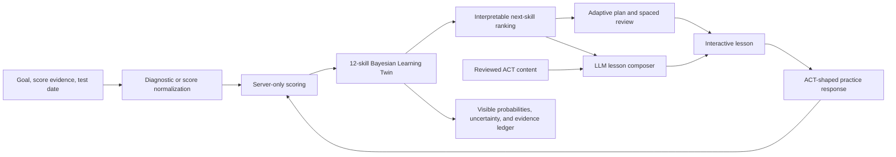

# Scout ACT technical architecture

## Judge-level system view



The critical loop is **trusted response → probabilistic model update → next-skill decision → personalized teaching → new trusted response**. The generative model is inside the teaching layer, while scoring and the learner model remain deterministic, testable, and inspectable.

## Why Bayesian Knowledge Tracing

For each ACT skill, Scout stores the probability that the learner has acquired the skill. After a response, it uses the classic BKT observation update:

```text
Correct:
P(L | correct) = P(L)(1 - slip) /
                 [P(L)(1 - slip) + (1 - P(L))guess]

Incorrect:
P(L | incorrect) = P(L)slip /
                   [P(L)slip + (1 - P(L))(1 - guess)]

Learning transition:
P(L next) = posterior + (1 - posterior)transition

Next-answer probability:
P(correct next) = P(L next)(1 - slip) + (1 - P(L next))guess
```

Difficulty changes guess and slip assumptions. Hard items have a lower guess probability and a higher slip probability than easy items. Every update stores the before/after probabilities without exposing the correct answer key.

## Next-skill decision

Each skill receives an interpretable 0–100 priority score:

```text
52% knowledge gap
24% model uncertainty
14% evidence scarcity
10% recent lapse pressure
```

The weights are explicit product-policy parameters, not hidden LLM reasoning. The Learning Twin UI shows the contribution of each feature. Sparse evidence is intentionally prioritized so the system gathers information rather than becoming confident from a short diagnostic.

## Generative teaching boundary

The lesson composer receives:

- the selected reviewed ACT skill and authored base lesson;
- diagnostic skill evidence;
- goal, current score, days until test, and session length; and
- a strict structured-output schema.

It may personalize lesson depth, opening, guided explanation, strategy checklist, and transfer prompt. It may not alter question keys, official scoring, BKT probabilities, XP, or review schedules. Invalid, missing, or timed-out provider output falls back to a reviewed deterministic lesson.

## Trust boundaries

| Boundary          | Public client receives                                            | Server retains                              |
| ----------------- | ----------------------------------------------------------------- | ------------------------------------------- |
| Diagnostic        | prompt, choices, progress, post-submit feedback                   | answer key, rationale before submission     |
| Practice          | prompt, choices, skill, difficulty                                | answer key, misconception tags, scoring     |
| Learning Twin     | probabilities, uncertainty, update event, recommendation features | trusted response validation and persistence |
| Generative lesson | structured lesson and provider stamp                              | provider credentials and prompt assembly    |

## Package map

| Package            | Responsibility                                                            |
| ------------------ | ------------------------------------------------------------------------- |
| `packages/core`    | scoring, diagnostics, planning, BKT, missions, study plans, exam analysis |
| `packages/content` | original reviewed diagnostic, skill, lesson, and practice content         |
| `packages/server`  | durable repositories, trusted scoring flow, lesson/debrief composition    |
| `apps/web`         | Next.js routes, cookies, server wiring, and responsive Scout UI           |

## Persistence and production path

The hackathon build uses atomic JSON-file repositories so judges can run the entire system without provisioning an external service. Repository boundaries isolate persistence. A production deployment would replace them with authenticated Postgres repositories, encrypted user identifiers, rate limiting, telemetry, and calibrated BKT parameters learned from consented longitudinal data.
